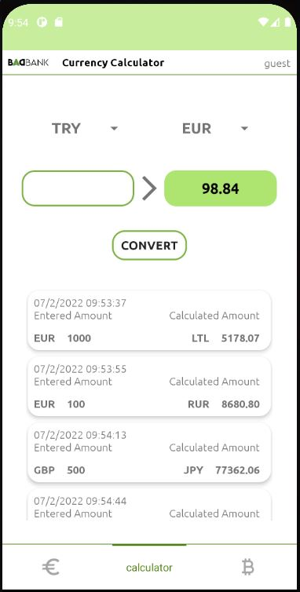

## **BAADBANK android app.** 

## ABOUT
#### This repository contains an app that implements MVVM (repository, fragment, viewmodel) architecture using Hilt, Kotlin coroutines, Flow, Firebase, Datastore  
**BAAD** bank is not that bad. Its green, gluten free and eco friendly  
Name **BAAD** is an acronym of the first letters of its creators names.  like ABBA :) 

## FEATURES
with this app users can:

- register and open savings account
- control their savings account. ADD or TAKE the amount (only registered users)
- see official and commercial currency rates. 
- calculate between currencies
- get information about top 100 cryptocurrencies.  
- update user credentials, change and reset password. 

## SCREENSHOTS
   

## APP PACKAGES
-**data**: It contains all the data accessing and manipulating components.  
-**di**: Dependency providing classes using Hilt.  
-**extensions**: imageView (glide) and view (snackbar) kotlin extensions  
-**network**: api interfaces  
-**repository**: all repository classes  
-**ui**: View classes along with viewmodels, basefragment and recycler adapters.  
-**utils**: Utility classes.  

## TECHNOLOGIES

- Design pattern -  MVVM 
- Safe args - navigation component
- ViewBinding
- Flow
- Hilt for dependency injection
- Glide for loading images
- Retrofit for making HTTP request
- Moshi for parsing JSON
- Firebase realtime database for storing user and savings information
- Firebase authentication 
- Lottie animations for progressbar
- Bottom animation bar
- Material components
- Datastore

## ENJOY

