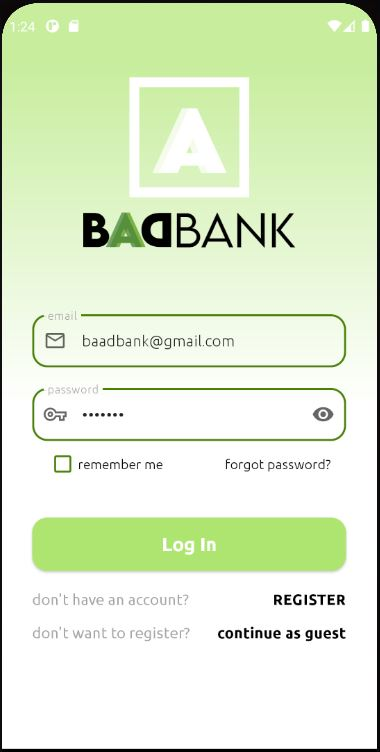
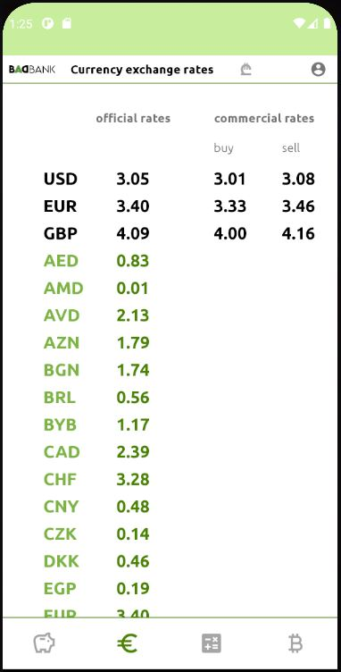
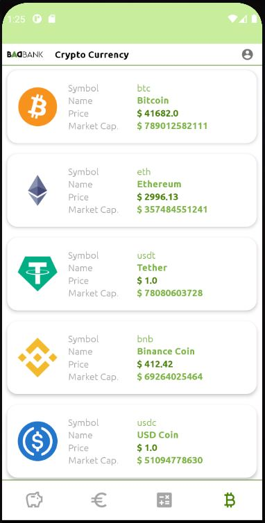

## **BAADBANK android app.** 

## ABOUT
mobile app from BAADBANK. 
baad bank is not that bad. its green, gluten free and eco friendly :) 
Name BAAD is an acronym of the first letters of its creators first and last names.  like ABBA :) 

## FEATURES
with this app users can:

- register and open savings account
- control their savings account. ADD or TAKE the amount (only registered users)
- see official and commercial currency rates. 
- calculate between currencies
- get information about top 100 cryptocurrencies.  
- update user credentials, change and reset password. 

## SCREENSHOTS
  

## APP PACKAGES
-**data**: It contains all the data accessing and manipulating components.  
-**di**: Dependency providing classes using Hilt.  
-**extensions**: imageView (glide) and view (snackbar) kotlin extensions  
-**network**: api interfaces  
-**repository**: all repository classes  
-**ui**: View classes along with viewmodels, basefragment and recycler adapters.  
-**utils**: Utility classes.  

## TECHNOLOGIES

- kotlin
- design pattern -  MVVM 
- navigation safe args
- view binding
- flow
- hilt for dependency injection
- glide for loading images
- retrofit for making HTTP request
- moshi
- firebase realtime database for storing user information and savings information
- firebase auth 
- androidx core splashcreen
- lottie animations for progressbar
- bottom animation bar
- material components
- datastore

## ENJOY

